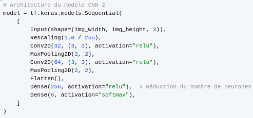

# MGL869-IA

```python
# Architecture du modèle CNN
model = tf.keras.models.Sequential(
    [
        Input(shape=(img_width, img_height, 3)),
        Rescaling(1.0 / 255),
        Conv2D(32, (3, 3), activation="relu"),
        MaxPooling2D(2, 2),
        Conv2D(64, (3, 3), activation="relu"),
        MaxPooling2D(2, 2),
        Conv2D(128, (3, 3), activation="relu"),
        MaxPooling2D(2, 2),
        Flatten(),
        Dense(512, activation="relu"),
        Dense(6, activation="softmax"),
    ]
)
```

```python
# Architecture du modèle CNN 2
model = tf.keras.models.Sequential(
    [
        Input(shape=(img_width, img_height, 3)),
        Rescaling(1.0 / 255),
        Conv2D(32, (3, 3), activation="relu"),
        MaxPooling2D(2, 2),
        Conv2D(64, (3, 3), activation="relu"),
        MaxPooling2D(2, 2),
        Flatten(),
        Dense(256, activation="relu"),  # Réduction du nombre de neurones
        Dense(6, activation="softmax"),
    ]
)
```
